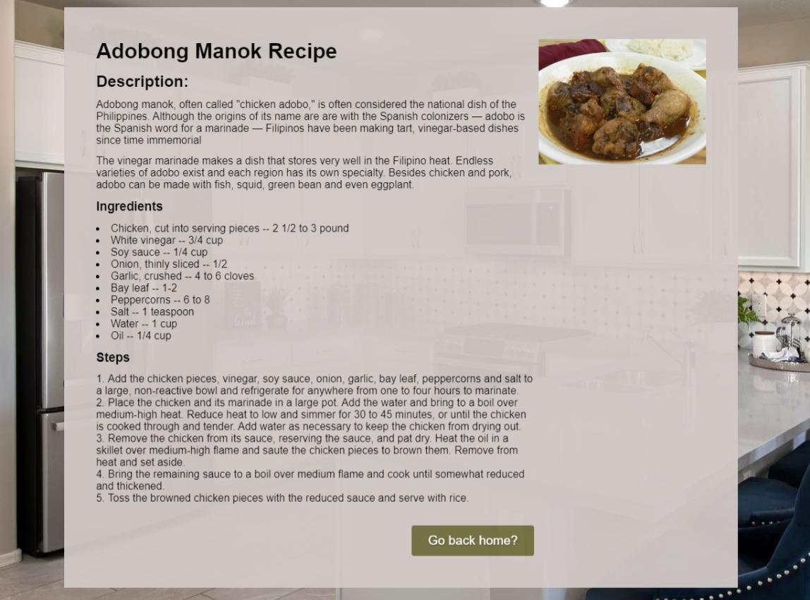

# Project Title

<h1 align="center">Odin Food Recipe's</h1>

<!-- SITE PREVIEW -->

## Site Preview

Check out the live demo [here](https://frogerall.github.io/odin-recipe/) 🌐

## Description

This is a simple static recipe website created as an exercise from The Odin Project. It features a handful of easy-to-follow local and foreign recipes, perfect for anyone looking to experiment in the kitchen. There's no agenda here, just a casual space to explore and enjoy the art of cooking.

## Tools and Technology Used

- [HTML](https://developer.mozilla.org/en-US/docs/Web/HTML) 🌐
- [CSS](https://developer.mozilla.org/en-US/docs/Web/CSS) 🎨
- [Git](https://git-scm.com/doc) 🛠️ (Version Control)
- [Google](https://www.google.com) 🔍 (for searching and referencing recipes)

(<a href="#readme-top">back to top</a>)

## Authors

**Author:**

- Adrian Salitico

  - [GitHub](https://github.com/frogerall)
  - [LinkedIn](https://linkedin.com/in/nairda4)
  - Email: saliticoadrian@gmail.com

  You can reach out to me for suggestions, comments, or just to chat!

(<a href="#readme-top">back to top</a>)

## Acknowledgments

Inspiration, code snippets, etc.

- [The Odin Project](https://www.theodinproject.com)
